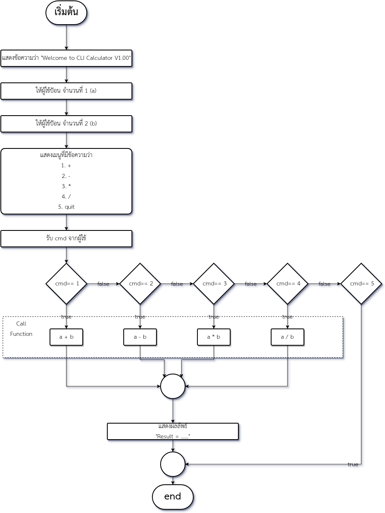

# โจทย์ข้อสอบปลายภาค การเขียนโปรแกรมคอมพิวเตอร์ ปวส. 1 / 2560

## ข้อที่ 1

### เขียนโปรแกรมเครื่องคิดเลขได้ โดยการทำงานเป็นไปตามผังงานดังนี้

**เงื่อนไขเพิ่มเติม**

เขียนฟังก์ชันการ บวก ลบ คูณ หาร แยกจากฟังก์ชัน main() และทำการเรียกใช้ฟังก์ชันให้ถูกต้อง

#### การทดสอบและให้คะแนน

| Test case                                   | Result         | Score |
| :------------------------------------------ | :------------- | :---- |
| เปิดโปรแกรม -> ป้อน 10 -> ป้อน 20 -> ป้อน 1 | Result = 30    | 1     |
| เปิดโปรแกรม -> ป้อน 15 -> ป้อน 20 -> ป้อน 2 | Result = -5     | 1     |
| เปิดโปรแกรม -> ป้อน 2 -> ป้อน 5 -> ป้อน 3   | Result = 10    | 1     |
| เปิดโปรแกรม -> ป้อน 10 -> ป้อน 2 -> ป้อน 4  | Result = 5     | 1     |
| เปิดโปรแกรม -> ป้อน 10 -> ป้อน 4 -> ป้อน 4  | Result = 2.5   | 2     |
| เปิดโปรแกรม -> ป้อน 10 -> ป้อน 4 -> ป้อน 5  | จบโปรแกรมทันที | 2     |
| มีการเขียนฟังก์ชันแยกและเรียกใช้งาน         | ----           | 2     |

* * *

## ข้อที่ 2

### เขียนโปรแกรมจัดการรายชื่อนักศึกษา โดยมีความสามารถและเมนูดังนี้

1.  บันทึกชื่อนักศึกษาลงไฟล์ ชื่อ std.txt
2.  แสดงรายชื่อนักศึกษาทั้งหมดที่อยู่ใน std.txt แบบปกติ
3.  แสดงรายชื่อนักศึกษาทั้งหมดที่อยู่ใน std.txt โดยให้อักษรตัวแรกเปลี่ยนเป็น X
4.  ค้นหารายชื่อว่า มีอยู่ใน std.txt หรือไม่

#### การทดสอบและให้คะแนน

| Test case                                                                     | Result                                    | Score |
| :---------------------------------------------------------------------------- | :---------------------------------------- | :---- |
| เปิดโปรแกรม -> แสดงเมนู                                                       | แสดงเมนูทั้งหมด 5 เมนู                    | 1     |
| เปิดโปรแกรม -> แสดงเมนู -> ป้อน 1 -> ป้อน Luffy -> ป้อน 5 -> เปิดไฟล์ std.txt | โปรแกรมปิดตัว และ std.txt มีข้อความ Luffy | 2     |
| เปิดโปรแกรม -> แสดงเมนู -> ป้อน 1 -> ป้อน Zoro -> ป้อน 2 -> ป้อน 5            | แสดง Luffy และ Zoro และโปรแกรมปิดตัว      | 2     |
| เปิดโปรแกรม -> แสดงเมนู -> ป้อน 3 -> ป้อน 5                                   | แสดง Xuffy และ Xoro  และโปรแกรมปิดตัว     | 2     |
| เปิดโปรแกรม -> แสดงเมนู -> ป้อน 4 -> ป้อน Zoro -> ป้อน 5                      | แสดง Found และโปรแกรมปิดตัว               | 1     |
| เปิดโปรแกรม -> แสดงเมนู -> ป้อน 4 -> ป้อน Nami -> ป้อน 5                      | แสดง Not Found และโปรแกรมปิดตัว           | 1     |
| เปิดโปรแกรม -> แสดงเมนู -> ป้อน 5                                             | โปรแกรมปิดตัว                             | 1     |
